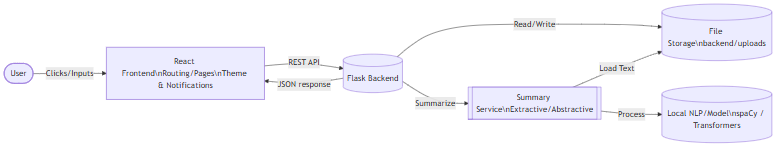
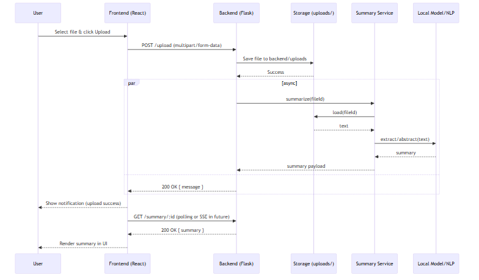

# AI Medical History Summary Generator – Competition Submission

## Executive Summary
This submission presents a full-stack AI-enabled application featuring a Python Flask backend and a React frontend. The system provides secure upload/management of patient-like documents, a responsive dashboard UI, theming, notifications, and a ready-to-run developer experience. The documentation includes architecture, data flow, project structure, setup, evaluation, risks, ethics, and future work.

## Problem Statement
Design a small, maintainable AI-driven app scaffold with a clear frontend–backend separation, easy local setup, and UX primitives (theme, notifications, navigation). The system should be extensible for future AI tasks like document analysis, summarization, and history tracking while maintaining clean architecture.

## Key Features
- Robust project bootstrap with one-line start scripts for Windows, macOS, Linux
- Flask backend with upload handling and basic routes
- React frontend with themed UI, navigation, notifications, loading states
- Modular code structure ready for AI integrations (e.g., document summarization)
- Clear developer ergonomics and documentation

## System Architecture
High-level architecture showing user interactions with frontend, and API communication with backend.

<p align="center">
  
  <br/>
  <em>Figure 1. System architecture.</em>
 </p>

### Components
- Frontend (React): Routing, pages (`Dashboard`, `History`, `Login`, `Settings`, `Summary`), global `ThemeProvider`, notifications, and loading UI.
- Backend (Flask): REST endpoints, file upload handling under `backend/uploads`, and core app startup in `backend/app.py`.
- Shared Scripts: Cross-platform setup and start scripts at the repository root.

## Data Flow
User events on the frontend trigger API calls to the backend. The backend processes requests (e.g., file operations) and returns responses rendered by the frontend. Notifications provide user feedback; the theme system ensures consistent styling.

<p align="center">
  
  <br/>
  <em>Figure 2. Upload sequence.</em>
 </p>

## Technology Stack
- Backend: Python, Flask
- Frontend: React, JavaScript, Node.js tooling
- Tooling: npm scripts, cross-platform shell/batch scripts
- Diagrams: Mermaid (rendered as PNG for portability)

## Project Structure
```text
b:\\AI Project\\
  - backend\\
    - app.py
    - requirements.txt
    - uploads\\
      - alice patient.txt
      - burner patient.txt
      - cloe patient.txt
      - General-Check-Up-Report.webp
      - Jon Patient.txt.txt
      - patient 1.txt
      - patient.txt
  - frontend\\
    - node_modules\\
    - package-lock.json
    - package.json
    - public\\
      - index.html
    - src\\
      - App.js
      - components\\
        - Loading.js
        - Navigation.js
        - NotificationSystem.js
        - ThemeProvider.js
      - index.css
      - index.js
      - pages\\
        - Dashboard.js
        - History.js
        - Login.js
        - NotificationTest.js
        - Settings.js
        - Summary.js
        - ThemeTest.js
  - Makefile
  - NOTIFICATION_TESTING_GUIDE.md
  - package-lock.json
  - QUICK_START.md
  - README.md
  - setup-project.bat
  - setup-project.ps1
  - setup-project.sh
  - start-project.bat
  - start-project.ps1
  - start-project.sh
  - test-notifications.html
  - test-theme.html
  - THEME_FIXES_SUMMARY.md
  - update-theme-colors.js
```

## Backend Overview
- Entry point: `backend/app.py`
- Dependencies: `backend/requirements.txt`
- Upload storage: `backend/uploads/`
- Designed to extend with AI services (e.g., NLP pipelines for summarization)

## Summary Creation
This project includes a planned, modular approach to generating summaries from uploaded documents. The pipeline is designed to work locally by default and can be swapped for cloud models if allowed by competition rules.

### Current Baseline (lightweight, local)
- Simple text normalization and extraction from `.txt` files
- Heuristic extractive summary: sentence scoring via keyword frequency and basic ranking
- Optional stopword removal to improve signal-to-noise

### Planned Enhancements
- Linguistic features using a lightweight NLP library (e.g., `spaCy` small model or `nltk`) for sentence boundary detection and noun/verb phrase emphasis
- Model-based summarization using small local transformer models via `transformers` when permitted
- Retrieval-Augmented Generation to combine multiple files for a single coherent summary

### Design Principles
- Offline-first: prefer local execution; avoid sending data externally unless explicitly configured
- Replaceable strategy: a `summary_service` abstraction to switch implementations without changing routes
- Deterministic fallbacks: if models are unavailable, return an extractive summary

### Outputs
- Short abstract (1–3 sentences)
- Key points (bulleted)
- Optional highlights (counts, entities) for dashboards

### API Surface (initial)
- `POST /upload` – accepts multipart/form-data, stores file under `backend/uploads`
- `GET /health` – returns service health
- `GET /files` – lists uploaded files (future)
- `GET /summary/:id` – returns AI-generated summary (future)

### Environment Variables
- `PORT` – backend port (default 5000)
- `NODE_ENV` – frontend mode (`development` or `production`)
- `API_BASE_URL` – frontend-to-backend base URL

### Security Baseline
- Limit upload file types and size
- Sanitize file names, store outside web root
- Disable debug in production, hide stack traces
- Add CORS restrictions per environment
- Future: JWT-based auth, role-based access control

## Frontend Overview
- Entry point: `frontend/src/index.js`, root app in `frontend/src/App.js`
- Components: `ThemeProvider`, `NotificationSystem`, `Navigation`, `Loading`
- Pages: `Dashboard`, `History`, `Login`, `Settings`, `Summary`, `ThemeTest`, `NotificationTest`

### UX & Accessibility
- Color-contrast friendly theme tokens
- Keyboard-focus styles and skip-to-content (add in future)
- ARIA roles for nav and notifications
- Reduced motion preference respected (future)

### Notifications
- Non-blocking toasts via `NotificationSystem`
- Levels: info, success, warning, error

## Setup and Run
1. Prerequisites: Node.js 18+, Python 3.10+, pip
2. One-time setup (installs deps in both apps):
   - Windows: `setup-project.bat`
   - macOS/Linux: `./setup-project.sh`
3. Start servers:
   - Windows: `start-project.bat`
   - macOS/Linux: `./start-project.sh`
4. Access the frontend in your browser at the printed URL (typically `http://localhost:3000`).

### Local Development Tips
- Frontend: `npm start` from `frontend/`
- Backend: `python backend/app.py` (or `flask run` if configured)
- Update theme tokens using `update-theme-colors.js`

### Production Build (frontend)
- `cd frontend && npm run build` → outputs production bundle to `frontend/build`

## Evaluation Criteria
- Architecture clarity and modularity
- Code readability and maintainability
- UX quality: theming, notifications, responsiveness
- Extensibility for AI tasks (e.g., document processing)
- Documentation completeness

## AI Roadmap
- Phase 1: Rule-based extraction from text files (keywords, counts)
- Phase 2: Summarization using small local models (constraint-friendly)
- Phase 3: Retrieval-Augmented Generation for multi-file synthesis
- Phase 4: Feedback loop and evaluation harness (human-in-the-loop)

## Evaluation & Benchmarking
- Functional tests: upload/save/list
- UX checks: notification display and theme consistency
- Performance: upload latency, render FPS on dashboard
- AI quality (future): ROUGE/BLEU for summaries vs references

## Operating Guidelines
- Version pinning for critical deps; document upgrade steps
- Logging minimal PII; structured logs for server
- Backups of `backend/uploads/` in development (do not sync to public repos)

## Risks and Mitigations
- Data privacy for uploaded files → keep local, sanitize, apply access controls
- Dependency drift → pin key versions, provide setup scripts
- AI model integration complexity → abstract service layer, mock interfaces during dev

## Ethics and Privacy
- Handle any personal data responsibly
- Avoid storing sensitive data beyond what is necessary
- Provide clear user consent and data deletion options in future enhancements

## Future Work
- Integrate document parsing and summarization in `backend/app.py`
- Add user auth and RBAC to protect data
- Add automated tests (unit/e2e) and CI
- Add observability (logging, tracing)

## Submission Checklist
- Architecture and sequence diagrams included in `docs/diagrams/`
- PDF export: `docs/AI-Competition-Submission.pdf`
- Source document: `docs/AI-Competition-Submission.md`


